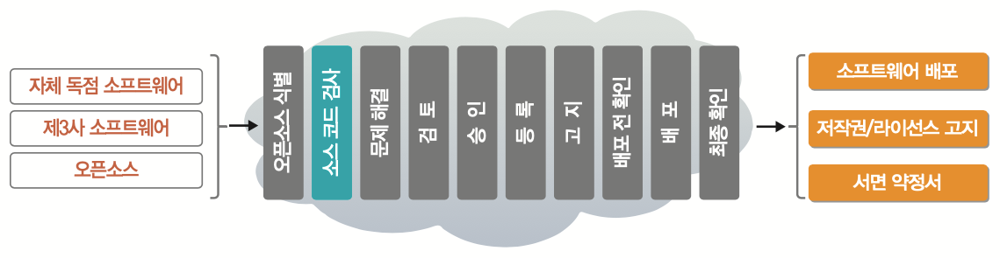

# 부록2. 오픈소스 컴플라이언스 프로세스 \(예시\)

오픈소스 컴플라이언스의 주요 두가지 목적은 다음과 같다.

1. 의무 파악 : 공급 대상 소프트웨어가 포함하고 있는 오픈소스를 식별하고 각 오픈소스 라이선스가 요구하는 의무를 파악한다.
2. 의무 사항 이행 : 식별한 의무 사항을 이행한다.

이를 위해 기업은 공급 대상 소프트웨어를 배포하는 시점에 오픈소스 라이선스 의무사항을 준수할 수 있도록 오픈소스 컴플라이언스 프로세스를 구축해야 한다. 여기서는 일반적인 오픈소스 컴플라이언스 프로세스의 구성요소와 각각의 기능 및 역할을 포함하는 프로세스\(예시\)를 제안한다. 


이 오픈소스 컴플라이언스 프로세스 \(예시\)는 다음 자료를 참고하여 작성하였다. 

* Open Source Compliance In The Enterprise / Ibrahim Haddad : [https://www.linuxfoundation.org/compliance-and-security/2018/12/open-source-compliance-in-the-enterprise/](https://www.linuxfoundation.org/compliance-and-security/2018/12/open-source-compliance-in-the-enterprise/)


## &lt;OO 회사&gt; 오픈소스 컴플라이언스 프로세스 \(예시\)

&lt;OO 회사&gt;의 오픈소스 정책에 근거하여 오픈소스를 사용하기 위해서는 먼저 오픈소스 라이선스가 무엇인지 식별하고, 라이선스가 요구하는 의무 사항을 검토하고 확인해야 한다. 그렇게 공급 대상 소프트웨어에 포함된 오픈소스와 라이선스 의무사항을 식별하고, 소프트웨어를 배포 시 라이선스 의무사항을 준수하기 위한 오픈소스 컴플라이언스 활동을 해야 한다. 

&lt;OO회사&gt;의 오픈소스 컴플라이언스 프로세서는 공급 대상 소프트웨어에 사용되는 오픈소스를 관리하는 일련의 과정을 정의한다. 이 과정에는 다음 사항이 포함된다.

1. 공급 대상 소프트웨어에 사용된 모든 오픈소스 식별
2. 식별한 오픈소스에 의해 발생하는 모든 의무를 식별하고 추적
3. 모든 의무를 충족하기 위한 활동

이를 효과적으로 수행하기 위해 &lt;OO회사&gt;의 모드 소프트웨어 공급관리자는 다음 10단계를 수행한다. 

### Step 1. 오픈소스 식별 \(Identification of Open Source\)

오픈소스 식별 단계는 오픈소스 컴포넌트를 식별하기 위한 검토 단계이다. 자체 독점 소프트웨어인지, 제3자 소프트웨어인지 여부에 관계 없이 공급 대상 소프트웨어에 포함된 오픈소스를 모니터링한다. 오픈소스 식별 방법은 다음과 같다.

* 오픈소스 사용 요청 접수 : SW개발자는 특정 제품에 오픈소스를 사용하고자 함을 오픈소스 책임자 또는 오픈소스 센터에 알리고, 검토 및 승인을 위한 오픈소스 패키지의 용도에 관한 정보를 제공한다.
* 회사 개발 소프트웨어 검사 \(Auditing\) : 개발자가 오픈소스의 소스코드를 복사해서 가져와 소프트웨어를 개발할 수 있기 때문에 회사가 개발한 소프트웨어에 대해서도 검사를 수행한다.
* 제3자 소프트웨어 실사 \(Due diligence\)

<table>
  <thead>
    <tr>
      <th style="text-align:left">&#xC2DD;&#xBCC4; &#xB2E8;&#xACC4; &#xC2DC;&#xC791; &#xC870;&#xAC74;</th>
      <th
      style="text-align:left">&#xC2DD;&#xBCC4; &#xB2E8;&#xACC4; &#xACB0;&#xACFC;</th>
    </tr>
  </thead>
  <tbody>
    <tr>
      <td style="text-align:left">
        
&#x2022; &#xAC1C;&#xBC1C;&#xC790;&#xB85C;&#xBD80;&#xD130; &#xD2B9;&#xC815;
          &#xC624;&#xD508;&#xC18C;&#xC2A4; &#xC0AC;&#xC6A9; &#xC694;&#xCCAD; &#xC811;&#xC218;

        
&#x2022; &#xAC1C;&#xBC1C; &#xD504;&#xB85C;&#xC138;&#xC2A4; &#xC0C1; &#xC18C;&#xD504;&#xD2B8;&#xC6E8;&#xC5B4;
          &#xAC80;&#xC0AC; &#xB2E8;&#xACC4;

        
&#x2022; &#xC81C;3&#xC790; &#xC18C;&#xD504;&#xD2B8;&#xC6E8;&#xC5B4; &#xC785;&#xC218;
          &#xBC0F; &#xAC1C;&#xBC1C;&#xC18C;&#xD504;&#xD2B8;&#xC6E8;&#xC5B4;&#xB85C;&#xC758;
          &#xD1B5;&#xD569;

      </td>
      <td style="text-align:left">
        
&#x2022; &#xC624;&#xD508;&#xC18C;&#xC2A4;&#xC5D0; &#xB300;&#xD55C; &#xCEF4;&#xD50C;&#xB77C;&#xC774;&#xC5B8;&#xC2A4;
          &#xAE30;&#xB85D; &#xC0DD;&#xC131; (Jira &#xB4F1; &#xD65C;&#xC6A9;)

        
&#x2022; &#xC18C;&#xC2A4;&#xCF54;&#xB4DC; &#xC2A4;&#xCE94; &#xB300;&#xC0C1;
          &#xC120;&#xC815; &#xBC0F; &#xC694;&#xCCAD;

      </td>
    </tr>
  </tbody>
</table>### Step 2. 소스 코드 검사 \(Auditing Source Code\)

소스 코드 검사 단계에서는 소스 코드 분석 도구를 사용하여 소스 코드를 스캔하여 오픈소스를 발견한다. 소스 코드 스캔도구는 FOSSology를 이용한다. GPL-3.0 등 정책적으로 사용할 수 없는 오픈소스 라이선스가 적용된 오픈소스 혹은 라이선스 충돌로 양립할 수 없는 오픈소스가 발견될 경우 문제로 식별하여 개발팀에 보완을 요청한다.

<table>
  <thead>
    <tr>
      <th style="text-align:left">&#xC18C;&#xC2A4; &#xCF54;&#xB4DC; &#xAC80;&#xC0AC; &#xB2E8;&#xACC4; &#xC2DC;&#xC791;
        &#xC870;&#xAC74;</th>
      <th style="text-align:left">&#xC18C;&#xC2A4; &#xCF54;&#xB4DC; &#xAC80;&#xC0AC; &#xB2E8;&#xACC4; &#xACB0;</th>
    </tr>
  </thead>
  <tbody>
    <tr>
      <td style="text-align:left">&#x2022; &#xC18C;&#xC2A4; &#xCF54;&#xB4DC; &#xC2A4;&#xCE94; &#xC694;&#xCCAD;
        (Jira ticket &#xC0DD;&#xC131;)</td>
      <td style="text-align:left">
        
&#x2022; &#xC18C;&#xC2A4; &#xCF54;&#xB4DC; &#xC2A4;&#xCE94; &#xACB0;&#xACFC;
          &#xC0DD;&#xC131; (&#xC624;&#xD508;&#xC18C;&#xC2A4; &#xCD9C;&#xCC98;, &#xB77C;&#xC774;&#xC120;&#xC2A4;
          &#xB4F1; &#xC815;&#xBCF4; &#xD3EC;&#xD568;)

        
&#x2022; &#xC2DD;&#xBCC4;&#xB41C; &#xBB38;&#xC81C;&#xC5D0; &#xB300;&#xD574;
          &#xAC1C;&#xBC1C;&#xD300;&#xC5D0; &#xBCF4;&#xC644; &#xC694;&#xCCAD; (Jira
          ticket &#xC0DD;&#xC131;)

      </td>
    </tr>
  </tbody>
</table>### Step 3. 문제 해결 \(Resolving Issues\)

소스 코드 검사 단계에서 식별된 모든 문제를 해결한다. 문제 사항은 Jira Ticket으로 생성하여 개발팀에 할당되고, 오픈소스 책임자는 모든 문제가 적절하게 해결되었는지 확인한다.

| 문제 해결 단계 시작 조건 | 문제 해결 단계 결 |
| :--- | :--- |
| • 소스 코드 스캔 완료 및 결과 생성 • 문제 식별 | • 식별된 문제를 모두 해결 |

### Step 4. 검토 \(Reviews\)

식별된 모든 문제가 해결되면 검토 단계로 이동한다. 검토 단계의 절차는 다음과 같다.

1. 소프트웨어 PL : 소프트웨어에 포함된 오픈소스에 대한 사용 승인 요청서를 제출한다.
2. 오픈소스 책임자 : 사용 승인 요청서를 접수하면 모든 정보가 누락없이 포함 되었는지를 확인하고, Jira ticket을 생성하여 검토 절차를 진행한다.
3. 소스코드 검사 담당자: Jira ticket이 생성되면 소스코드 검사를 수행하여 문제가 모두 해결되었는지 확인한다. 
4. 법무팀 : 라이선스 이슈를 검토한다.

| 검토 단계 시작 조건 | 검토 단계 결과 |
| :--- | :--- |
| • 식별된 모든 문제 해결 | • 오픈소스 책임자, 소스코드 검사 담당자, 법무팀 등의 검토를 완료하여 승인 준비가 된 상태 |

### Step 5. 승인 \(Approval\)

검토가 완료되면 Jira ticket은 승인 단계로 이동한다. OSRB는 오픈소스의 사용을 승인하거나 거절한다. 거절시에는 이유에 대한 설명과 수정 방법을 제안한다. OSRB가 오픈소스 구성요소의 사용을 승인하면 개발팀은 라이선스 의무를 이행하기 위한 준비를 시작한다.

<table>
  <thead>
    <tr>
      <th style="text-align:left">&#xC2B9;&#xC778; &#xB2E8;&#xACC4; &#xC2DC;&#xC791; &#xC870;&#xAC74;</th>
      <th
      style="text-align:left">&#xC2B9;&#xC778; &#xB2E8;&#xACC4; &#xACB0;&#xACFC;</th>
    </tr>
  </thead>
  <tbody>
    <tr>
      <td style="text-align:left">&#x2022; &#xAC80;&#xD1A0;&#xAC00; &#xC644;&#xB8CC;&#xB41C; &#xC0C1;&#xD0DC;</td>
      <td
      style="text-align:left">
        
&#x2022; OSRB&#xB294; &#xC624;&#xD508;&#xC18C;&#xC2A4;&#xC758; &#xC0AC;&#xC6A9;&#xC744;
          &#xC2B9;&#xC778;&#xD558;&#xAC70;&#xB098; &#xAC70;&#xC808;&#xD568;

        
&#x2022; &#xAC70;&#xC808; &#xC2DC;&#xC5D0;&#xB294; &#xC774;&#xC720;&#xC5D0;
          &#xB300;&#xD55C; &#xC124;&#xBA85;&#xACFC; &#xC218;&#xC815; &#xBC29;&#xBC95;
          &#xC81C;&#xC548;

        </td>
    </tr>
  </tbody>
</table>### Step 6. 등록 \(Registration\)

사용이 승인된 오픈소스 구성요소는 오픈소스 사용을 추적하는 BOM \(소프트웨어 인벤토리\)에 추가한다. BOM에는 오픈소스 구성요소 이름, 버전, 관리 담당자 이름, 이를 사용하는 제품 이름, 제품 버전, 제품 릴리즈 번호 등의 정보를 포함한다. BOM을 관리하는 도구는 SW360을 사용한다.

| 등록 단계 시작 조건 | 등록 단계 결과 |
| :--- | :--- |
| • OSRB가 오픈소스 사용을 승인 | • 오픈소스 구성요소를 BOM에 등록 |

### Step 7. 고지 \(Notices\)

오픈소스를 사용할 때 주요 의무 중 하나는 고지 의무이다. 이를 위해 다음 사항을 수행 한다.

* 저작권, 라이선스 고지를 제공한다.
* 라이선스 사본을 제공한다.
* \(해당되는 경우\) 소스 코드 사본을 얻을 수 있는 방법을 최종 사용자에게 알린다.

| 고지 단계 시작 조건 | 고지 단계 결과 |
| :--- | :--- |
| 오픈소스를 BOM에 등록 | 저작권, 라이선스 고지를 준비하고, 이를 제품에 포함되도록 관련 부서로 전달 |

이와 같은 사항을 제품 배포 시 포함시킬 수 있도록 관련 부서에 전달한다. 화면이 있는 제품이면 사용자가 메뉴 &gt; 오픈소스 고지 정보에서 오픈 소스 고지 내용을 확인할 수 있게 한다. 제품에 화면이 없을 경우, 사용자 매뉴얼에 오픈소스 고지 내용을 포함시킨다.

### Step 8. 배포 전 확인 \(Pre-Distribution Verifications\)

이 단계에서는 다음 사항을 보장하기 위한 확인을 수행한다.

* 오픈소스 라이선스가 요구하는 공개할 소스 코드를 취합한다.
* 취합한 소스 코드는 제품에 탑재된 바이너리와 매치되어야 한다.
* 소스 코드 내 부적절한 주석을 제거한다.
* 적절한 고지문이 제품에 포함되었다. 여기에는 최종 사용자가 소스 코드를 받을 수 있는 방법 \(Written Offer\)도 함께 제공한다.

<table>
  <thead>
    <tr>
      <th style="text-align:left">&#xBC30;&#xD3EC; &#xC804; &#xD655;&#xC778; &#xB2E8;&#xACC4; &#xC2DC;&#xC791;
        &#xC870;&#xAC74;</th>
      <th style="text-align:left">&#xBC30;&#xD3EC; &#xC804; &#xD655;&#xC778; &#xB2E8;&#xACC4; &#xACB0;&#xACFC;</th>
    </tr>
  </thead>
  <tbody>
    <tr>
      <td style="text-align:left">&#x2022; &#xBAA8;&#xB4E0; &#xC624;&#xD508;&#xC18C;&#xC2A4; &#xAD6C;&#xC131;&#xC694;&#xC18C;&#xAC00;
        BOM&#xC5D0; &#xB4F1;&#xB85D;</td>
      <td style="text-align:left">
        
&#x2022; &#xACE0;&#xC9C0; &#xC758;&#xBB34;&#xB97C; &#xC774;&#xD589;&#xD560;
          &#xC218; &#xC788;&#xB3C4;&#xB85D; &#xC870;&#xCE58;
           &#x2022; &#xACF5;&#xAC1C;&#xD560; &#xC18C;&#xC2A4; &#xCF54;&#xB4DC; &#xCDE8;&#xD569;

        
&#x2022; &#xC18C;&#xC2A4; &#xCF54;&#xB4DC; &#xC81C;&#xACF5; &#xBC29;&#xBC95;
          &#xACB0;&#xC815;
           &#x2022; &#xBC30;&#xD3EC; &#xC804; &#xD655;&#xC778; &#xC218;&#xD589; &#xC644;&#xB8CC;

      </td>
    </tr>
  </tbody>
</table>### Step 9. 배포 \(Distribution\)

배포 전 확인이 완료되면 공개할 소스 코드 패키지를 오픈소스 배포사이트에 업로드한다. 오픈소스 배포사이트에는 제품 및 버전별로 등록할 수 있다. 최종 사용자는 자신이 원하는 제품의 버전에 해당하는 소스 코드 패키지를 오픈소스 배포사이트에서 검색하여 다운로드 받을 수 있다.

| 배포 단계 시작 조건 | 배포 단계 결과 |
| :--- | :--- |
| • 모든 배포 전 확인 완료 | • 특정 제품의 버전에 대한 공개할 소스 코드 패키지를 오픈소스 배포사이트에 업로드 |

### Step 10. 최종 확인 \(Final Verifications\)

공개할 소스 코드 패키지를 오픈소스 배포사이트에 업로드 후 패키지가 올바르게 업로드 되었고, 외부에서 오류 없이 다운로드 및 압축 해제가 되는지 확인한다. 라이선스에 따라 빌드하여 바이너리 생성까지 보장을 요구하는 경우, 외부에서 다운받은 소스 코드가 README의 안내대로 오류 없이 빌드하여 바이너리가 생성되는지, 생성된 바이너리가 제품에 탑재된 바이너리와 동일한지 확인한다.

| 최종 확인 단계 시작 조건 | 최종 확인 단계 결과 |
| :--- | :--- |
| • 공개할 소스 코드가 오픈소스 배포사이트에 게시 | • 외부에서 다운로드가 이상없이 수행되는지, 제품과 동일한 버전의 바이너리와 매치가 되는지 확인 |

